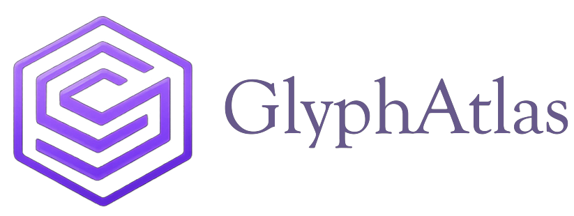

<div align="center">
  

  # GlyphAtlas
  **Unicode to Codepoint Converter — Made simple.**

  
  
  
  

</div>

---

## The Problem

If you have ever worked with **non-Latin characters** in a native C/C++ project — Chinese, Arabic, Tamil, Cyrillic, or any other script — you know the frustration.

Every time you need a character, you have to search online to find its Unicode value. Most tools give you something like this:

```
\u4f60\u597d\u4e16\u754c
```

That's `你好世界`. But that format is useless on its own. To actually use it in C/C++, you need it as:

```c
int codepoints[] = { 0x4f60, 0x597d, 0x4e16, 0x754c };
int count = 4;
```

Reformatting that by hand — every single time — is a hassle that adds up fast.

**Asking AI?** Sure, but that burns tokens for something that should be instant and free.

### The Raylib angle

This problem hits especially hard when using **[raylib](https://www.raylib.com/)**. Raylib has limited UTF-8 support out of the box, and the **only reliable way to render non-Latin glyphs** is to load their codepoints explicitly at font load time using `LoadFontEx`. Without the right codepoint array, your characters simply won't render.

This isn't a workaround — it's the only way.

---

## The Idea

> *"What if there was a small tool that just takes your characters, and spits out a ready-to-use codepoint array with a count — no reformatting, no searching, no AI tokens wasted?"*

That question is what started GlyphAtlas. It was built first for personal use during game development, then polished and shared because this is a problem that affects anyone doing C/C++ work with international text — not just game developers.

---

## Features

- **Instant conversion** — type or paste any non-Latin text and get results live
- **C/C++ array format** — `int codepoints[] = { 0x... };` ready to paste
- **Multiple output formats** — C++ vector, JSON, space-separated, Unicode escape
- **Codepoint count** — `int count = N;` generated automatically
- **Live preview** — see your glyphs rendered at large size, cycle through available fonts
- **Quick info** — decimal count, UTF-8 byte size, first/last codepoint, detected script
- **Copy All** — dumps every format to clipboard in one click
- **Clean dark UI** built with CustomTkinter

---

## Screenshots

> *(Add screenshots here)*

---

## Getting Started

### Requirements

- Python 3.10 or higher
- pip

### Install & Run

```bash
# Clone the repo
git clone https://github.com/vk22006/glyph-atlas.git
cd glyph-atlas

# Install dependencies
pip install -r requirements.txt

# Launch
python main.py
```

---

## Usage

1. Type or paste any text containing non-Latin characters into the **Input Text** field.
2. GlyphAtlas instantly shows:
   - The **C/C++ codepoint array** — ready to copy into your source file
   - The **codepoint count** variable
   - A **live preview** of the glyphs
   - Alternative formats via the **Other Formats** tabs
3. Hit **Copy** on any block, or **Copy All** to grab everything at once.

---

## Project Structure

```
GlyphAtlas/
├── main.py          # Entry point
├── app.py           # UI — all pages, sidebar, layout
├── theme.py         # Design tokens (colors, fonts, spacing)
├── utils.py         # Unicode logic — extraction, formatting
├── requirements.txt
└── assets/
    └── logo.png
```

---

## Dependencies

| Package | Purpose |
|---|---|
| `customtkinter` | Modern dark-mode UI framework |
| `Pillow` | Image handling for logo and icons |

---

## A Note on Origin

GlyphAtlas started as a personal tool built out of necessity during game development with raylib. It lived quietly on a local machine for a while before the decision was made to clean it up and release it — because if this problem was frustrating enough to build a tool for, others are likely hitting the same wall.

If it saves you even five minutes of reformatting, it has done its job.

---

## License

MIT — free to use, modify, and distribute.

---

<div align="center">
  <sub>Crafted for developers. ❤️</sub>
</div>
